# Show Mode — click-through

**Record it, import it, or drop screenshots and a transcript. Approve the steps.
Test the agent in your own Brainstem. Confirm. Promote — Copilot Studio, Scout,
Cowork, or keep it local.**

Show Mode is a Frontier-tagged path in RAPP Brainstem Frontier. Some customers
can describe their process (the [interview loop](../../README.md)); some would
rather show it. Show Mode turns a live recording, a video, a set of screenshots,
or a transcript into a single-file agent you hotload and **test in your own
Brainstem first**, then promote into the Microsoft AI stack.

This page is the built-in click-through preview, frame by frame. It is a
**preview**: the panes paint synthetic content over the real UI; nothing is
recorded, analyzed, hotloaded, or sent. Run it yourself from the **Show Mode:
click-through preview** pill in the Brain Surgeon, from the intro tile, or open
[`beta/show-mode.html`](../../show-mode.html) as a shareable page.

> Screenshots below are produced by driving the real Frontier window through the
> UI-driver bridge — `npm run show-mode:capture` — the same path an AI uses to
> operate the Brainstem for a user. They are captured **without** AI force mode
> so the images read cleanly for anyone following along.

---

### 1 · Two ways in — describe it, or show it
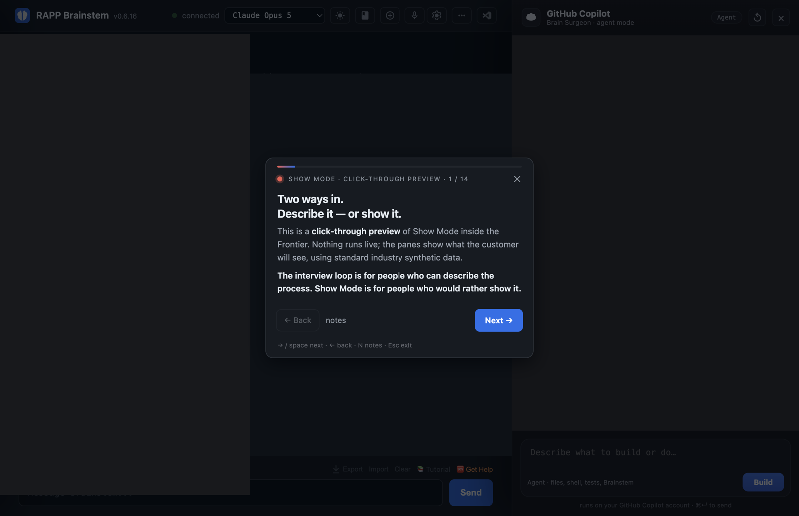

### 2 · The interview loop, for people who can describe the process
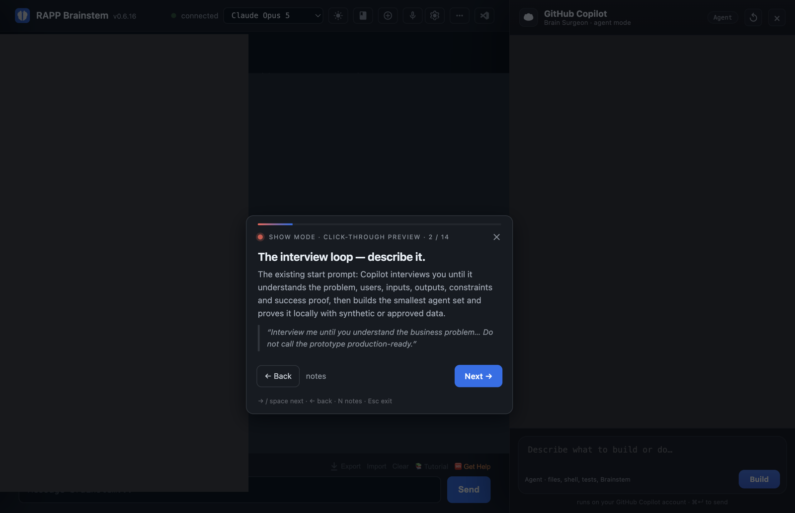

### 3 · Show Mode — one pill in the Brain Surgeon
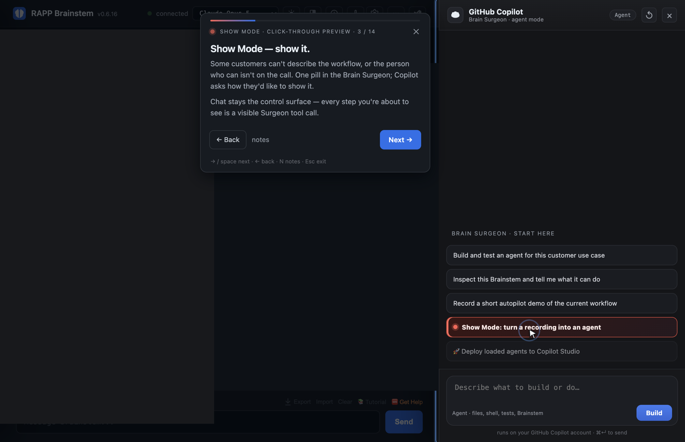

### 4 · Four doors into one pipe: record, video, screenshots, transcript
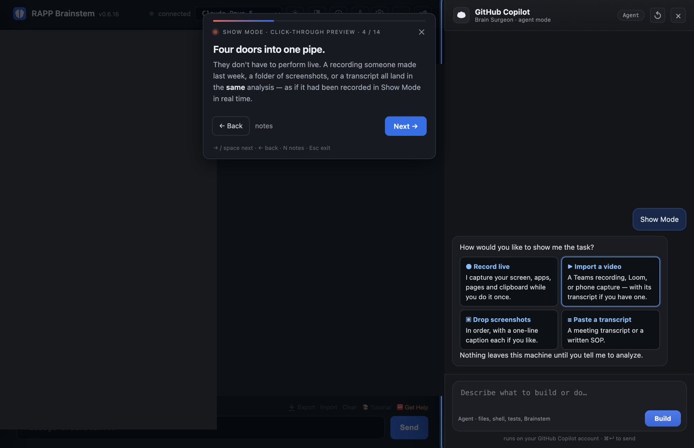

### 5 · Import a recording — consent is a chat turn
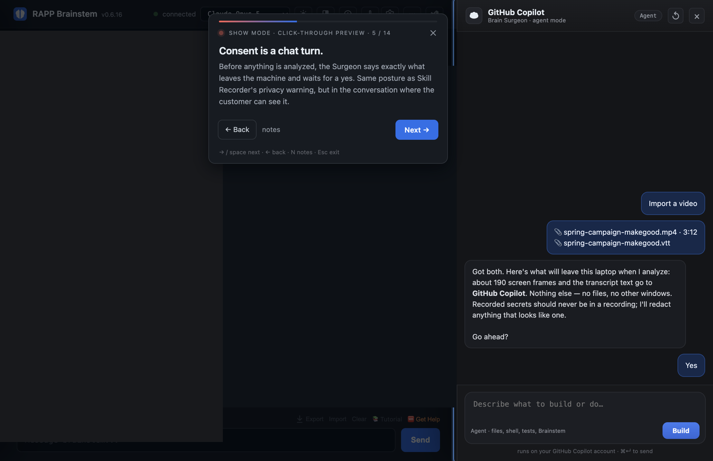

### 6 · Copilot reconstructs the intent and the ordered steps
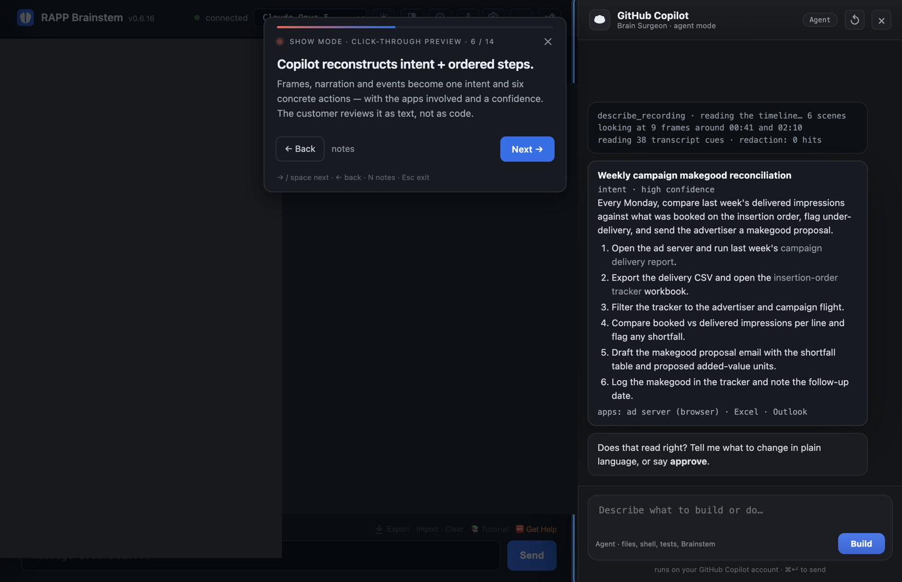

### 7 · Edit it like you'd correct a colleague
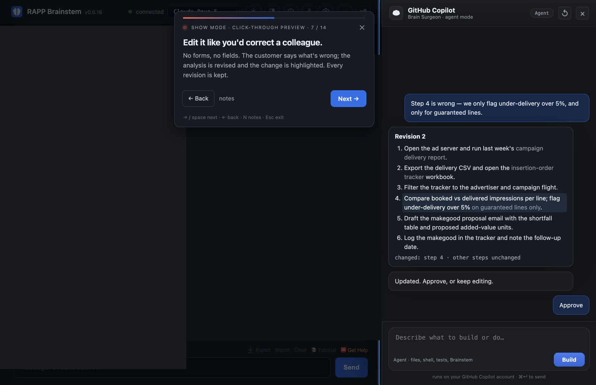

### 8 · The approved steps become a single-file agent
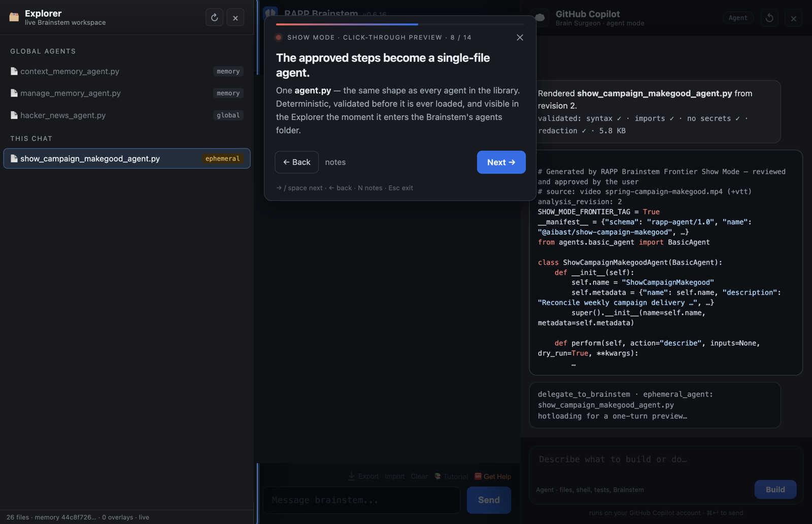

### 9 · Hotloaded into the real Brainstem — for one turn
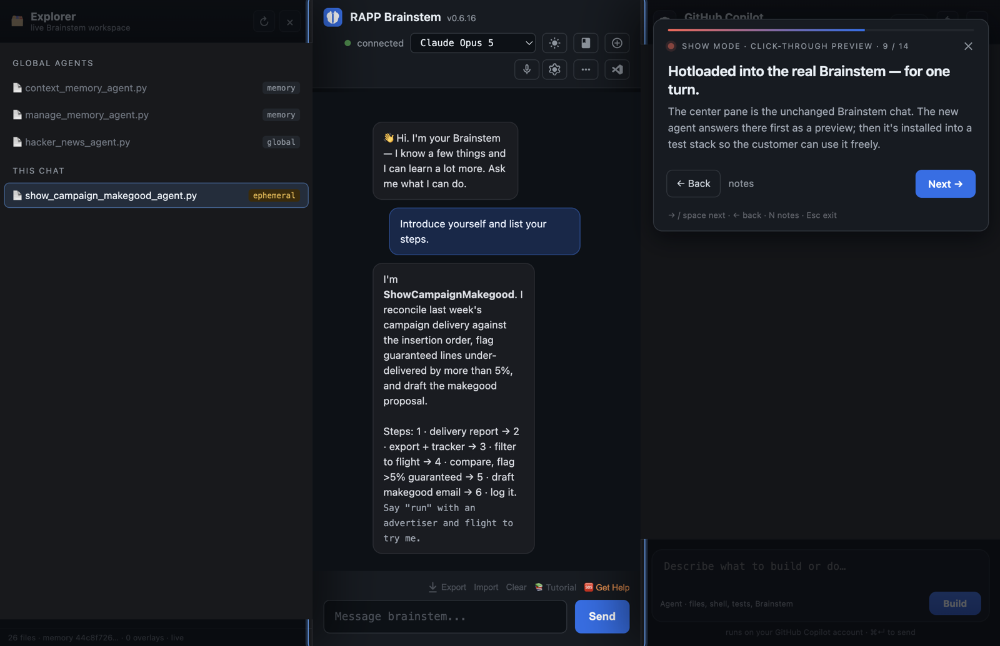

### 10 · They test it — proof of value on the same call
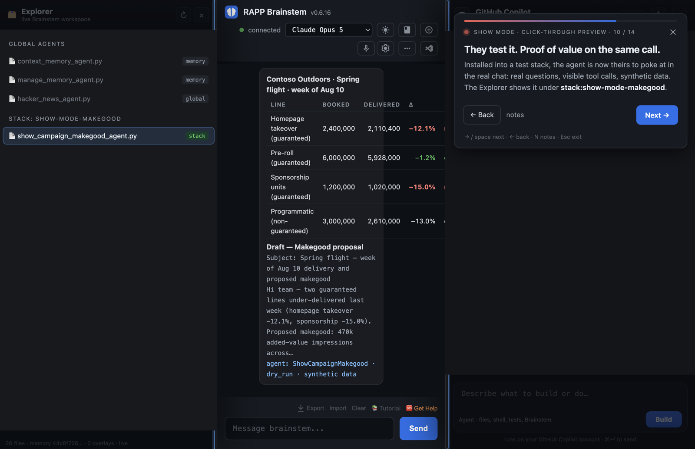

### 11 · Confirmation records the evidence
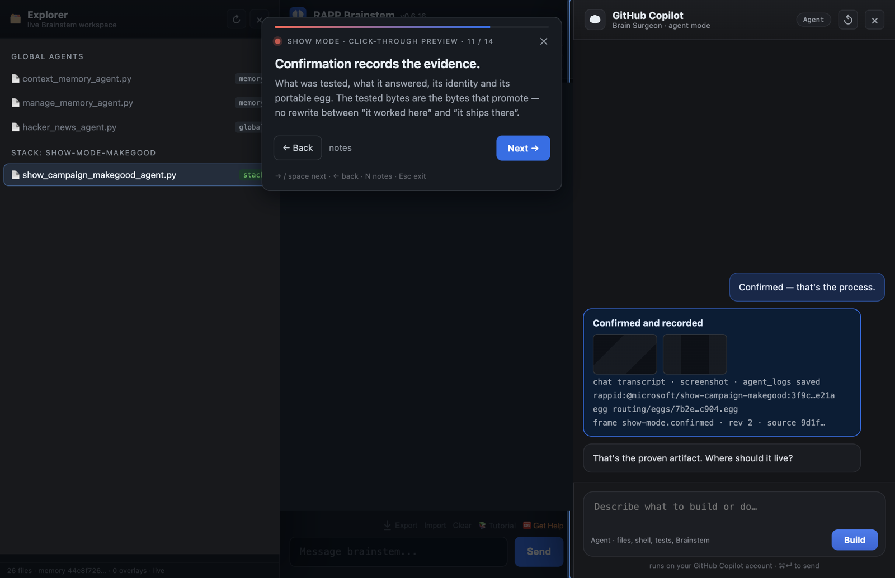

### 12 · Maps into the whole Microsoft AI stack
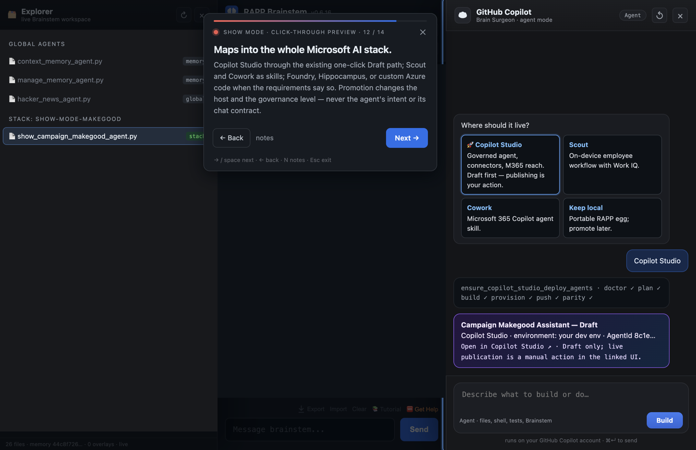

### 13 · Why this is the launchpad
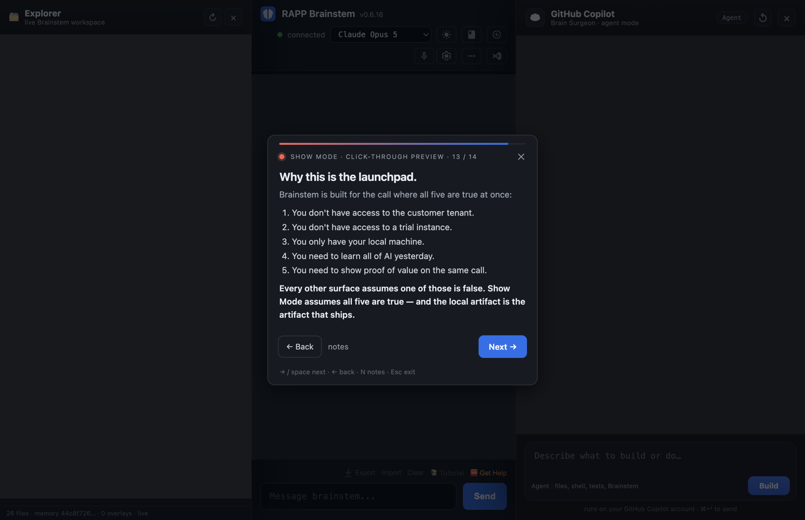

### 14 · That's Show Mode
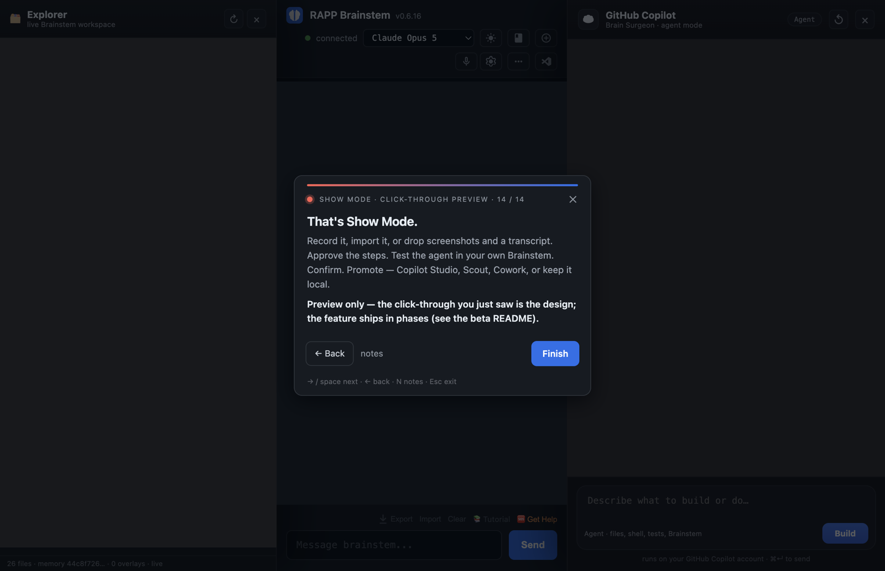

---

## AI force mode

When an AI drives the Brainstem for a user through chat — "use AI force mode to
do X and let me watch" — the whole window's edges glow and a tag reads
**AI FORCE MODE · AN AI IS DRIVING THIS BRAINSTEM — YOU'RE WATCHING**, so the
person always knows an AI, not a hand, is moving the interface. It is hidden
until invoked and fades on its own when the AI goes quiet.

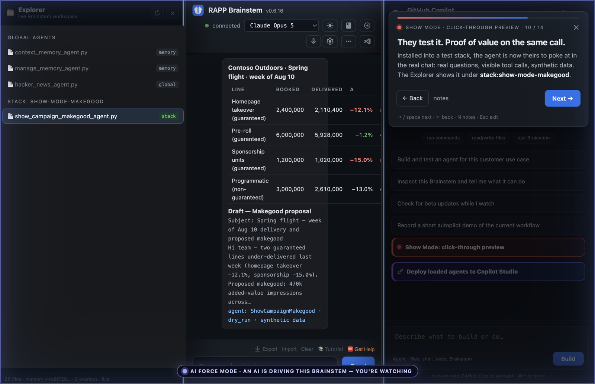

## Reproduce these images

```bash
# From an open Frontier window (Copilot sign-in NOT required):
npm run show-mode:capture                 # clean images for the README (force mode off)
npm run show-mode:capture -- --force      # same walk with AI force mode lit, for a live demo
node scripts/show-mode-capture.mjs --out docs/show-mode --pace 1100
```

Each run also writes `index.json` recording the step order, pace, and whether
force mode was lit.
