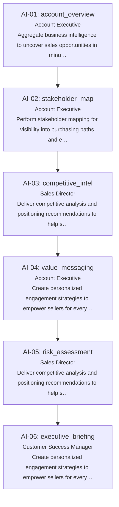

# Account Intelligence Agent — flow diagram

Auto-generated from the ordered case contract at `tests/demo_cases/account-intelligence.json`. Each node is one locked case, in file order, labeled with its persona and operation. This is a process-flow view of the scenario, not an implementation architecture diagram (see `README.md` for architecture).

